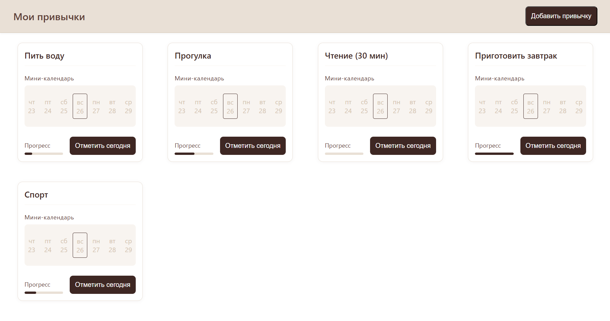

# 🧠 Smart Habit Tracker

> Веб-приложение для отслеживания и управления персональными привычками с визуализацией прогресса.



## 📌 О происхождении проекта

> **Важно:** Данный проект изначально разрабатывался в приватном репозитории (корпоративный GitLab Т-Банка) в рамках учебного курса Т-Интенсив по JavaScript (2 часть). Код был перенесён в этот публичный репозиторий после завершения работы для демонстрации портфолио. Поэтому история коммитов не отражает реальной хронологии разработки.

## 🚀 Демо и репозиторий

- **Демо:** [https://sw1ftfox.github.io/course-work/](https://sw1ftfox.github.io/course-work/)
- **Репозиторий:** [https://github.com/Sw1ftFox/course-work](https://github.com/Sw1ftFox/course-work)

## 📦 Стек технологий

| Категория        | Технологии                           |
| ---------------- | ------------------------------------ |
| Язык / фреймворк | React, TypeScript                    |
| Сборка           | Vite                                 |
| UI‑библиотека    | CSS Modules                          |
| Стейт‑менеджмент | Redux Toolkit                        |
| Маршрутизация    | React Router                         |
| Backend          | Firebase (Authentication, Firestore) |
| Хостинг          | GitHub Pages                         |

## ✨ Особенности

- **Авторизация пользователей** – регистрация и вход через email/пароль или Google аккаунт.
- **Трекер привычек** – создание, редактирование, удаление и отслеживание ежедневных привычек.
- **Визуализация прогресса** – календарь выполнения и прогресс-бары.
- **Cloud‑синхронизация** – данные хранятся в Firebase и доступны с любого устройства.
- **Адаптивный дизайн** – корректное отображение на мобильных и десктопных устройствах.

## 🛠️ Установка и запуск

```bash
git clone https://github.com/Sw1ftFox/course-work.git
cd course-work
npm install

# Создайте файл .env.local с вашими Firebase ключами (см. .env.example)
npm run dev
```

```bash
# .env.example
VITE_FIREBASE_API_KEY=ваш_apiKey
VITE_FIREBASE_AUTH_DOMAIN=ваш_authDomain
VITE_FIREBASE_PROJECT_ID=ваш_projectId
VITE_FIREBASE_STORAGE_BUCKET=ваш_storageBucket
VITE_FIREBASE_MESSAGING_SENDER_ID=ваш_messagingSenderId
VITE_FIREBASE_APP_ID=ваш_appId
```

## 📂 Структура проекта (основные папки)

src/
├── app/ # Глобальные настройки (store, хуки)
├── features/ # Функциональные модули (auth, habits)
├── pages/ # Страницы приложения
├── services/ # Работа с Firebase
├── shared/ # Переиспользуемые компоненты (Header, Button, Spinner)
├── styles/ # CSS Modules
└── utils/ # Вспомогательные функции
